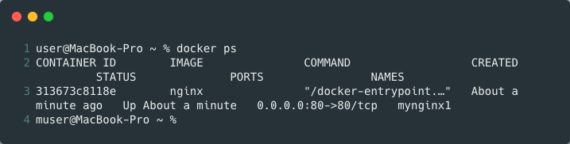

# docker-command
 1) To install docker visit **https://docs.docker.com/docker-for-mac/install/**
 2) Once installed open terminal and type - 
     *docker run hello-world*
    
     
     ** Congratulations  🥳  to run fisty docker command **
     
 3) To view the running **active** process 
    command - * docker ps *
     
          
